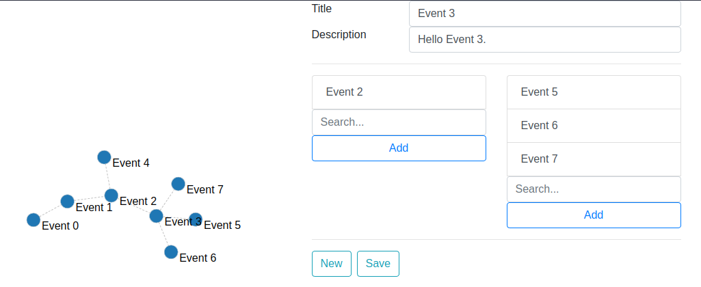

:toc:
:toclevels: 5

=== About

* A graph based calendar / process planner.
* Repo for frontend.
* See also `owocal-server`.

image::img/owo.png[,10%]

{empty} +

=== Planned Features

* From plain canvas:
** Add event
*** with
**** summary
**** start time
**** end time
**** description (optional)
**** optional flag (optional)
* From existing event:
** Add event
*** as customer
*** as supplier
* UI
** Left side:
*** Canvas with Vis.js
** Right side:
*** Event details
* Deployment
** PAS -> Spring -> Angular

{empty} +

=== Run

* `docker compose up --force-recreate`
* go to `http://localhost:9051/`
